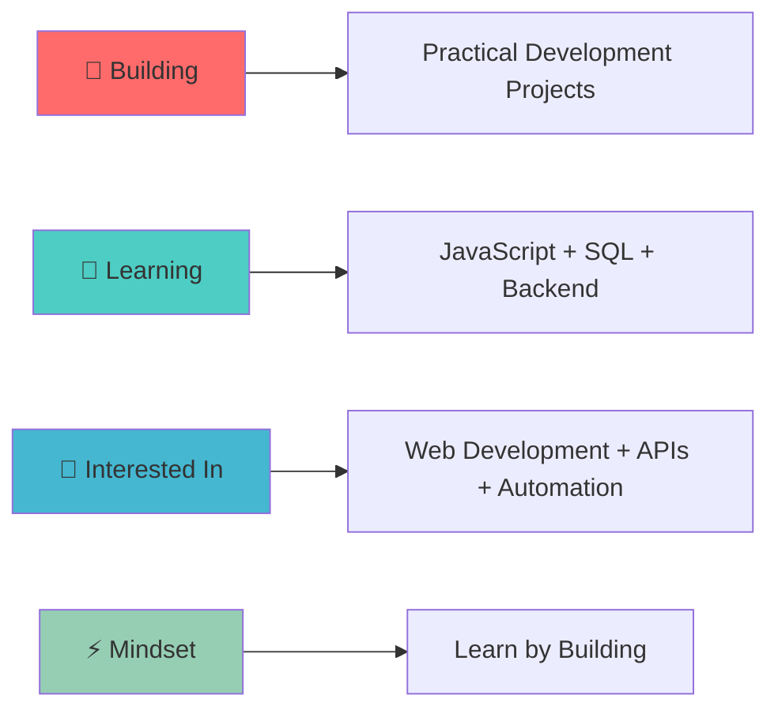

<div align="center">

  <!-- Animated Header -->

  

  <!-- Typing Animation -->

  

</div>

---

<div align="center">

## 🎯 WHO AM I?

<table>
<tr>
<td>

</td>
<td>

```yaml
name: Mohamed Arab
location: Morocco
current_focus: Software Development
education: YouCode

currently_learning:
  - JavaScript
  - SQL
  - PostgreSQL
  - Backend Development
  - Web Development

previous_focus:
  - n8n Automation
  - APIs
  - Workflow Development
  - Business Process Automation

mindset: Learning by building
goal: Become a well-rounded developer
```

</td>
</tr>
</table>

</div>

---

<div align="center">

## 🚀 TECH STACK & TOOLS


<br/><br/>

**Tools & Technologies I Work With**

`JavaScript` `SQL` `PostgreSQL` `Supabase` `n8n` `Docker` `Git` `GitHub` `REST APIs` `Google Sheets`

<br/><br/>

<!-- Programming Languages -->

 **Languages I Speak:**


</div>

---

<div align="center">

## 📊 GITHUB ANALYTICS


<br/>


</div>

---

<div align="center">

## 🏆 ACHIEVEMENTS & TROPHIES


</div>

---

<div align="center">

## 💼 FEATURED PROJECTS

<table>
<tr>

<td width="50%">

### 🏠 Property Search WhatsApp Bot

A real-estate assistant that allows users to search properties through WhatsApp, retrieve matching listings from a database, share property images, and hand conversations over to an agent when needed.

**Tech Stack:**
`n8n` `PostgreSQL` `WhatsApp API` `Google Calendar API`

</td>

<td width="50%">

### 🤖 Telegram Real Estate State Manager

A Telegram-based automation system designed to manage conversation state and real-estate workflows for agencies.

**Tech Stack:**
`n8n` `Supabase` `Telegram Bot API`

</td>

</tr>

<tr>

<td width="50%">

### ⚙️ Automation Projects Collection

A collection of reusable automation workflows, scripts and tools built from real-world projects. Projects are anonymized and organized using IDs such as `AUT-001`, `AUT-002`, etc.

**Tech Stack:**
`n8n` `Docker` `PHP` `Python` `PostgreSQL`

[](https://github.com/MohaAarab/projects-collection)

</td>

<td width="50%">

### 💻 YouCode Projects

A growing collection of JavaScript exercises, challenges and projects built while developing my programming fundamentals at YouCode.

**Tech Stack:**
`JavaScript` `Git` `GitHub`

[](https://github.com/MohaAarab/YouCode-repo)

</td>

</tr>
</table>

</div>

---

<div align="center">

## 🎯 CURRENT FOCUS



</div>

---

<div align="center">

## 📈 CONTRIBUTION GRAPH


</div>

---

<div align="center">

## 🌐 CONNECT WITH ME


[](https://aarabautomation.com)
[](https://www.linkedin.com/in/mohamed-aarab-automation-specialist/)

### 💬 Let's Talk About:

 💻 Software Development
 ⚡ JavaScript & APIs
 🗄️ SQL & Databases
 🤖 Automation & Workflow Systems
 🚀 Building Practical Projects
 📚 Learning & Developer Growth

</div>

---

<div align="center">

## 📊 WEEKLY DEVELOPMENT BREAKDOWN

<!--START_SECTION:waka-->

<!--END_SECTION:waka-->

</div>

---

<div align="center">


<br/><br/>

### Thanks for visiting! Keep building. 🚀


</div>
